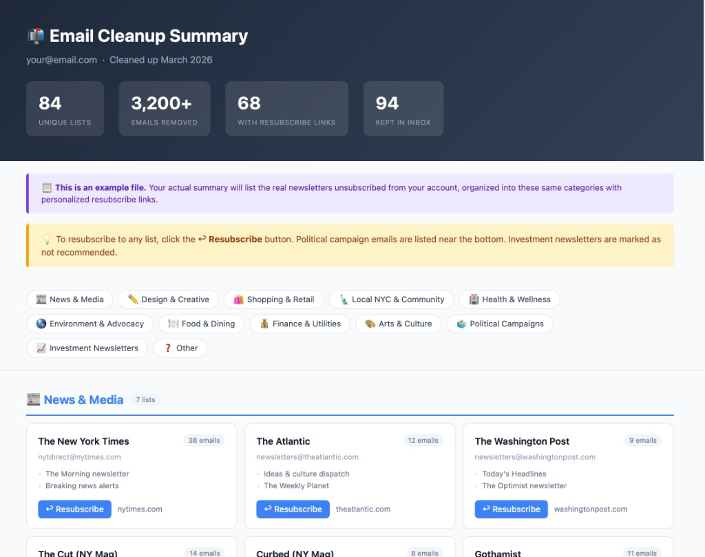

# Email Cleanup Prompt (IMAP)

Use this when you want help cleaning up your IMAP inbox without accidentally losing anything important. The goal is to clear out spam, newsletters, marketing, political, and social emails while keeping personal and useful service mail safe.

## Example summary

At the end, you should get an HTML summary with categories, counts, and resubscribe links so you can undo anything later if you want. **[Example summary](https://kidhack.github.io/prompts/email-cleanup/newsletter_summary_example.html)** — or open `newsletter_summary_example.html` from this folder locally.



---

## Before you send the prompt

Before you paste this into an agent, quickly edit the bracketed placeholders so it matches your account and your preferences:

- Do not use your main email password if you can avoid it. If your provider supports app passwords, use one for this. If it does not, consider temporarily changing your account password before running this workflow, then change it again immediately afterward.
- Replace the IMAP server, email address, password or app password, and SMTP server with your real account details.
- Update the final email address so the summary gets sent back to you.
- Fill in the whitelist with any senders that might look like bulk mail but are actually important to keep.
- Remove any cleanup bullets you do not want. For example, if you want to keep political emails or social notifications, delete those lines before sending.
- Add any extra safety rules you care about before you run it.

If you are unsure about a sender, whitelist it first. It is much easier to delete something later than to recover an important message that was removed by mistake.

## The Prompt

```
I need help cleaning up an IMAP email account. Here are the details:

**Account credentials:**
- IMAP server: [e.g. imap.sonic.net / imap.gmail.com / outlook.office365.com]
- Email address: [email@example.com]
- Password / app password: [password]
- SMTP server (for sending unsubscribes): [e.g. smtp.sonic.net]

**What I want cleaned up:**
- Delete and unsubscribe from newsletters that are never read
- Delete and unsubscribe from all political fundraising/campaign emails
- Delete and unsubscribe from all marketing and promotional emails
- Delete and unsubscribe from all social media notification emails
- Remove spam

**Senders to always keep (whitelist) — never delete or unsubscribe these:**
- [e.g. no-reply@meetflo.com — smart home water alerts]
- [e.g. invoices@mybank.com — bank statements]
- [e.g. noreply@myinsurance.com — insurance updates]
- [Add any other senders that look like bulk mail but are actually important]

**Rules to follow — please be conservative:**
- If you're not sure about an email, move it to a new "Review" folder rather than deleting it
- Keep all personal emails from friends and family untouched
- Keep any email that has already been read
- Move read emails in the inbox that are older than 1 month to a new "Older" folder
- For important service emails (utilities, banks, shipping, medical, smart home alerts), keep them in the inbox or ask me before deleting

**After the cleanup:**
1. Send unsubscribe requests (via List-Unsubscribe headers) for every sender that was deleted
2. Scan the Deleted Messages folder and flag anything that looks important so I can review it
3. Create an HTML summary of every newsletter/subscription that was unsubscribed, organized by category, with a resubscribe button/link for each one
4. Email the HTML summary directly to [email@example.com] with the subject: "→ → READ THIS - Email cleanup summary"

Please use IMAP directly (Python via Desktop Commander) rather than a browser.
```

---

## Setup notes and defaults

**App passwords:** If your account uses Gmail or Outlook with 2-factor authentication, your normal password usually will not work here. You will need an app-specific password:
- Gmail: myaccount.google.com → Security → App passwords
- Outlook: account.microsoft.com → Security → Advanced security → App passwords
- Yahoo: account.security.yahoo.com → Generate app password

**Common IMAP/SMTP servers:** If you are not sure what to enter, these are the usual defaults:

| Provider | IMAP server | SMTP server |
|---|---|---|
| Gmail | imap.gmail.com | smtp.gmail.com (port 587) |
| Outlook / Hotmail | outlook.office365.com | smtp.office365.com (port 587) |
| Yahoo | imap.mail.yahoo.com | smtp.mail.yahoo.com (port 587) |
| Apple iCloud | imap.mail.me.com | smtp.mail.me.com (port 587) |
| Sonic.net | imap.sonic.net | smtp.sonic.net (port 587) |
| Comcast/Xfinity | imap.comcast.net | smtp.comcast.net (port 587) |

**What gets deleted vs. moved:** This is the default behavior the prompt is aiming for:

| Type | Action |
|---|---|
| Spam (X-Spam headers, spam patterns) | Deleted |
| Social media notifications (Facebook, Instagram, LinkedIn, etc.) | Deleted + unsubscribed |
| Political fundraising/campaign emails | Deleted + unsubscribed |
| Unread newsletters (List-Unsubscribe header present) | Deleted + unsubscribed |
| Unread marketing/promotional emails | Deleted + unsubscribed |
| Read newsletters/marketing | Moved to Review |
| Uncertain / unrecognized senders | Moved to Review |
| Personal emails (from free mail domains, no bulk headers) | Kept |
| Read emails older than 1 month | Moved to Older |
